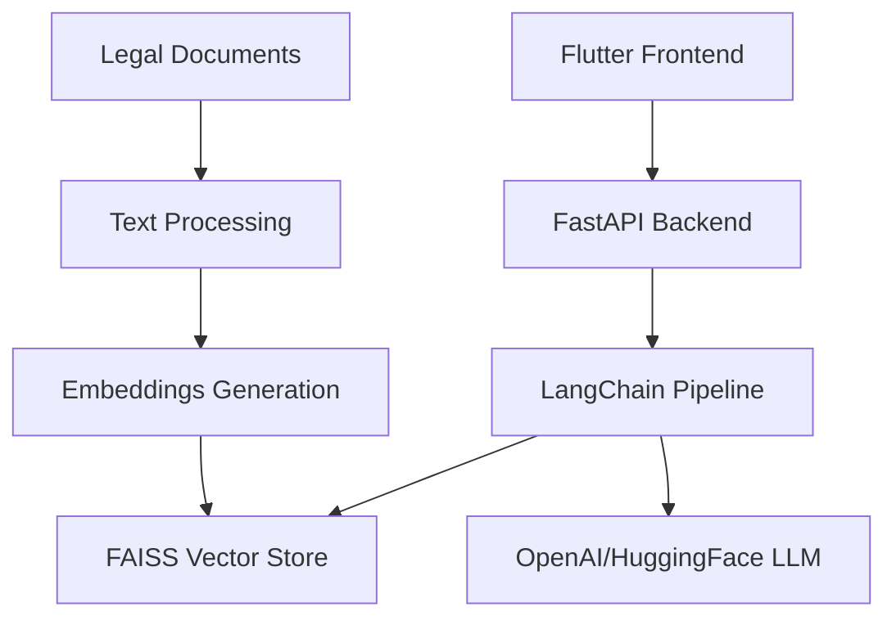
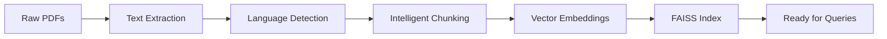

# ⚖️ Law-RAG: Bangladeshi Constitution & Law Chatbot

<div align="center">


**🏛️ Explore the Constitution of Bangladesh through AI-powered conversations**

[](https://fastapi.tiangolo.com/)
[](https://flutter.dev/)
[](https://langchain.com/)
[](https://github.com/facebookresearch/faiss)

</div>

---

## 🌟 Overview

**Law-RAG** is an intelligent Retrieval-Augmented Generation (RAG) system that makes Bangladeshi legal documents accessible through natural language conversations. Ask complex legal questions in **Bangla** or **English** and receive precise, contextual answers backed by official constitutional sources.

### 🎯 Key Highlights
- 🇧🇩 **Specialized for Bangladesh**: Constitution, legal acts, and regulations
- 🗣️ **Bilingual Support**: Natural queries in Bangla and English
- 🧠 **Context-Aware**: Maintains conversation history for follow-up questions
- 📱 **Cross-Platform**: Beautiful Flutter mobile interface
- ⚡ **Real-Time**: Fast vector-based document retrieval

---

## 🚀 Features

<table>
<tr>
<td width="50%">

### 💬 **Intelligent Chat Interface**
- Natural language processing for legal queries
- Contextual conversation memory
- Source citation with document references
- Multi-turn conversations for complex topics

</td>
<td width="50%">

### 🔍 **Advanced Retrieval**
- Semantic search through legal documents
- FAISS vector database for fast retrieval
- Relevance scoring and ranking
- Cross-lingual document matching

</td>
</tr>
<tr>
<td width="50%">

### 🌐 **Bilingual Excellence**
- **বাংলা**: সংবিধান ও আইন নিয়ে প্রশ্ন করুন
- **English**: Ask about constitutional rights and laws
- Automatic language detection
- Culturally appropriate responses

</td>
<td width="50%">

### 📚 **Comprehensive Coverage**
- Constitution of Bangladesh (1972)
- Legal amendments and modifications
- Fundamental rights and principles
- Government structure and powers

</td>
</tr>
</table>

---

## 🛠️ Technology Stack

<div align="center">

### Backend Architecture


</div>

| Component | Technology | Purpose |
|-----------|------------|---------|
| **🎨 Frontend** |  | Cross-platform mobile app |
| **⚡ Backend** |  | High-performance API server |
| **🔗 RAG Pipeline** |  | Document processing & retrieval |
| **🗃️ Vector DB** |  | Efficient similarity search |
| **🤖 LLM** |  | Natural language generation |
| **📄 Processing** |  | Document parsing & chunking |

---

## 📁 Project Structure

```
Law-RAG/
├── 📚 README.md                    # You are here!
├── 📋 requirements.txt             # Python dependencies
├── 🔐 .env.example                # Environment template
│
├── 🖥️ backend/
│   ├── 🚀 main.py                 # FastAPI application entry
│   ├── ⚙️ config.py               # Configuration management
│   ├── 📖 data_loader.py          # Document loading utilities
│   ├── ✂️ text_splitter.py        # Intelligent text chunking
│   ├── 🎯 embeddings.py           # Vector embedding generation
│   ├── 🗃️ vector_store.py         # FAISS database management
│   ├── 🔍 retriever.py            # Document retrieval logic
│   ├── 🧠 rag_pipeline.py         # Complete RAG workflow
│   └── 🧪 tests/
│       └── test_pipeline.py       # Automated testing
│
├── 📱 frontend/
│   ├── 📦 pubspec.yaml            # Flutter dependencies
│   └── 💻 lib/
│       ├── 🎯 main.dart           # App entry point
│       └── 🎨 widgets/            # Custom UI components
│
├── 📄 data/
│   ├── 📥 raw/                    # Original legal documents
│   ├── ⚡ processed/              # Cleaned & chunked text
│   └── 🎯 embeddings/             # Vector representations
│
└── 📊 notebooks/
    └── 🔬 exploration.ipynb       # Data analysis & experiments
```

---

## ⚡ Quick Start

### 🔧 Backend Setup

<details>
<summary><b>Click to expand backend installation steps</b></summary>

1. **Clone the repository**
   ```bash
   git clone https://github.com/yourusername/Law-RAG.git
   cd Law-RAG/backend
   ```

2. **Create virtual environment**
   ```bash
   # Windows
   python -m venv venv
   venv\Scripts\activate
   
   # macOS/Linux
   python3 -m venv venv
   source venv/bin/activate
   ```

3. **Install dependencies**
   ```bash
   pip install -r requirements.txt
   ```

4. **Configure environment**
   ```bash
   cp .env.example .env
   # Edit .env with your API keys
   ```

5. **Start the server**
   ```bash
   uvicorn main:app --reload --host 0.0.0.0 --port 8000
   ```

✅ **Backend running at**: `http://localhost:8000`

</details>

### 📱 Frontend Setup

<details>
<summary><b>Click to expand Flutter installation steps</b></summary>

1. **Navigate to frontend**
   ```bash
   cd ../frontend
   ```

2. **Get Flutter dependencies**
   ```bash
   flutter pub get
   ```

3. **Run on device/emulator**
   ```bash
   flutter run
   ```

📱 **App ready!** Start asking legal questions!

</details>

---

## 🎮 Usage Examples

<div align="center">

### 🇧🇩 **Bangla Queries**
```
"বাংলাদেশের সংবিধানে মৌলিক অধিকার কী কী?"
"প্রধানমন্ত্রীর ক্ষমতা ও দায়িত্ব কী?"
"সংসদের গঠন সম্পর্কে বলুন"
```

### 🇺🇸 **English Queries**
```
"What are the fundamental rights in Bangladesh Constitution?"
"Explain the powers of the Prime Minister"
"How is the Parliament structured?"
```

</div>

---

## 🗂️ Data Management

### 📥 **Document Sources**
- **Constitution of Bangladesh** (1972) - Original & amendments
- **Legal Acts & Ordinances** - Various legislative documents
- **Government Gazettes** - Official notifications
- **Court Judgments** - Landmark constitutional cases

### 🔄 **Processing Pipeline**


---

## 🏗️ Development Roadmap

<div align="center">

| Phase | Duration | Status | Key Features |
|-------|----------|--------|--------------|
| **🏃‍♂️ Phase 1** | Day 1 | ✅ Complete | Project setup, structure, documentation |
| **📚 Phase 2** | Day 2-4 | 🚧 In Progress | Data collection, preprocessing, chunking |
| **🎯 Phase 3** | Day 5-6 | ⏳ Planned | Embeddings generation, vector store setup |
| **🧠 Phase 4** | Day 7-8 | ⏳ Planned | RAG pipeline, FastAPI integration |
| **📱 Phase 5** | Day 9-12 | ⏳ Planned | Flutter frontend, UI/UX design |
| **🚀 Phase 6** | Day 13-14 | ⏳ Planned | Testing, deployment, final polish |

</div>

---

## 🌟 Future Enhancements

<table>
<tr>
<td width="50%">

### 🔮 **Version 2.0 Features**
- 🖼️ **Multi-modal Support**: Tables, charts, images
- 💾 **Enhanced Memory**: Long-term conversation context
- 🔔 **Legal Updates**: Push notifications for law changes
- 👤 **User Profiles**: Personalized legal assistance

</td>
<td width="50%">

### 🎯 **Advanced Capabilities**
- 🌐 **Multi-language**: Support for regional languages
- 🤖 **AI Lawyer**: Complex legal reasoning
- 📊 **Analytics**: Usage patterns and insights  
- 🔒 **Security**: End-to-end encryption

</td>
</tr>
</table>

---

## 🤝 Contributing

<div align="center">

**We welcome contributions from the community!**

[](CONTRIBUTING.md)

</div>

### 🛠️ **How to Contribute**
1. 🍴 **Fork** the repository
2. 🌿 **Create** a feature branch (`git checkout -b feature/amazing-feature`)
3. 💍 **Commit** your changes (`git commit -m 'Add amazing feature'`)
4. 📤 **Push** to the branch (`git push origin feature/amazing-feature`)
5. 🎯 **Open** a Pull Request

### 🐛 **Report Issues**
Found a bug? Have a feature request? [Open an issue](https://github.com/yourusername/Law-RAG/issues)!

---

## 📄 License

<div align="center">

[](https://opensource.org/licenses/MIT)

**MIT License © 2025 Law-RAG Project**

*This project is open source and free to use for educational and research purposes.*

</div>

---

## 🔗 Links & Resources

<div align="center">

| Resource | Link | Description |
|----------|------|-------------|
| 📖 **Documentation** | [Wiki](https://github.com/yourusername/Law-RAG/wiki) | Comprehensive guides |
| 🐛 **Issues** | [GitHub Issues](https://github.com/yourusername/Law-RAG/issues) | Bug reports & features |
| 💬 **Discussions** | [GitHub Discussions](https://github.com/yourusername/Law-RAG/discussions) | Community chat |
| 📧 **Contact** | [Email](mailto:your.email@example.com) | Direct communication |

[](https://github.com/yourusername/Law-RAG)
[](https://github.com/yourusername/Law-RAG)
[](https://github.com/yourusername/Law-RAG/issues)

</div>

---

## 💡 Pro Tips

<div align="center">

> **🎯 For Best Results**: Use specific legal terms in your queries  
> **🔄 Context Matters**: Build on previous questions in conversations  
> **📚 Explore Sources**: Check the cited document sections for deeper understanding  
> **🌐 Language Flexibility**: Switch between Bangla and English freely  

</div>

---

<div align="center">

### 🎉 **Ready to explore Bangladeshi law with AI?**

**[🚀 Get Started](#-quick-start) • [📚 Read Docs](https://github.com/yourusername/Law-RAG/wiki) • [💬 Join Community](https://github.com/yourusername/Law-RAG/discussions)**

---

*Made with ❤️ for the legal community of Bangladesh*

**⭐ Star this repo if it helped you understand Bangladeshi law better!**

</div>